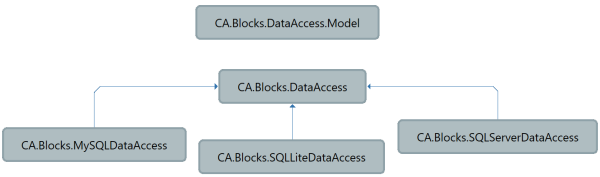

>The basic premise of the Data Access Blocks is to provide a simple interface to access a relational database. The blocks are split into three core components allowing flexible configurations.  

1. The Model  - CA.Blocks.DataAccess.Model used for client access in multi tier architectures.
2. The Core Abstract Data Access Logic - CA.Blocks.DataAccess used for abstract and shared non provider specific code.  
3. The specific implementation - eg    CA.Blocks.SQLServerDataAccess or CA.Blocks.SQLLiteDataAccess or CA.Blocks.MySQLDataAccess

<p align="center">
    
</p>

## The Model

The *model* represents the core design elements that you will need a client to specify. The client might not have access to the data access class as such the model is implemented in an independent assembly and will have no dependencies. An example is a the PagingRequest class. The paging request is a common element that is specified on the client and passed into the The specific implementation to execute. The paging class can then be shared on the client application allowing it to specify the paging request without having to have a reference to the  Data Access or any of the provider classes.  This would be typical in a web application, that access the service using  a web API. The CA.Blocks.DataAccess.Model has no dependencies. 

## The Core Abstract code

The code in the CA.Blocks.DataAccess is abstract and common among all providers.  The assembly will have no dependencies on any specific provider. This assembly handles the connection, execution and translation, all of these elements are in System.Data namespace. It will work at the System.Data level you will not find any specific reference to to any provider at this level.

## The specific implementation 
This code hooks in the specific provider implementation. So if you connecting to a Microsoft SQL server database  you will reference CA.Blocks.SQLServerDataAccess.  This in turn will bring in  CA.Blocks.DataAccess and CA.Blocks.DataAccess.Model in addition to System.Data.SqlClient. 

When using the DataAccess block to write a Data Access Class you only need to install the specific provider you need. For Examples:

To install for SQL server
```
PM> Install-Package CA.Blocks.SQLServerDataAccess -Version x.x.x
```

To install for Microsoft.Data.Sqlite
```
PM> Install-Package CA.Blocks.SQLLiteDataAccess -Version x.x.x
```

To install for MySqlConnector
```
PM> Install-Package CA.Blocks.MySQLDataAccess -Version x.x.x
```


## Protected by default 

Whilst all the core methods will allow processing of some sort SQL, the design is protected by default, even at the provider level.  Using the blocks there is no direct way to execute a SQL statement from the calling code. As the developer you may be tempted to expose this to avoid writing you own access methods by making the protected methods public.  Working directly with the SQL means as a developer you are responsible for the SQL generated this means responsibility for injection attacks.  The simplest way to avoid injection attacks is not executing any SQL that is not 100% controlled by the code. The developer is responsible for generating the SQL to be executed and this will be controlled in the DataAccess Layer.

See [Getting Started](#BLOCKDOCROOT#/GettingStarted)