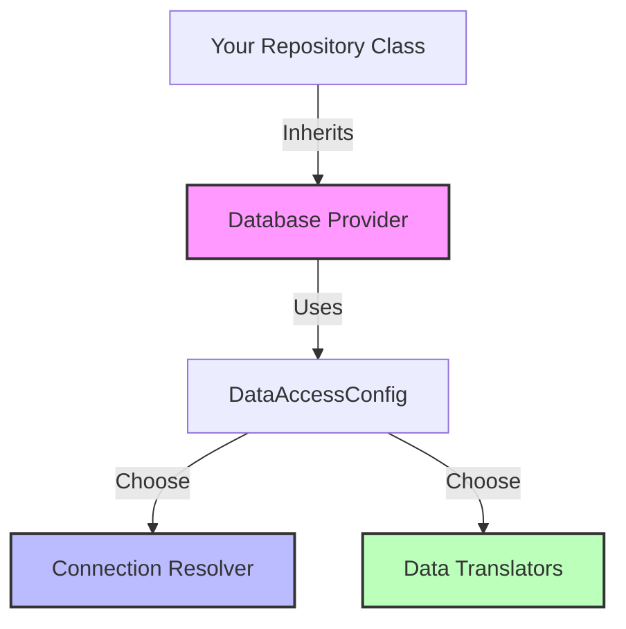

# Architecture & Design

`CA.Blocks.DataAccess` is built on a modular architecture of **"Pluggable Building Blocks"**. This design allows you to mix and match components to suit your specific database, configuration source, and data types while maintaining a consistent programming model.

## The Building Blocks

The library is composed of three primary pluggable layers:

1.  **Database Provider**: Choose your database (SQL Server, SQLite, MySQL, etc.).
2.  **Connection Resolver**: Choose how you resolve connection strings (JSON, Environment Variables, etc.).
3.  **Data Translators**: Choose how data is translated between the database and your C# objects (JSON, NUlid, Custom, etc.).

### Modular Flow

---

## 1. Database Providers
At the base of the stack is the Database Provider. The core library (`CA.Blocks.DataAccess`) provides the `DataAccessCore` abstract class, which implements the heavy lifting of ADO.NET management. Provider-specific packages then implement the concrete details for each engine.

| Database | Package | Base Class |
| :--- | :--- | :--- |
| **SQL Server** | `CA.Blocks.SQLServerDataAccess` | `SqlServerDataAccess` |
| **SQLite** | `CA.Blocks.SqliteDataAccess` | `SqliteDataAccess` |
| **PostgreSQL** | `CA.Blocks.PostgreSQLDataAccess` | `PostgresDataAccess` |
| **MySQL** | `CA.Blocks.MySQLDataAccess` | `MySqlDataAccess` |
| **ODBC** | `CA.Blocks.OdbcDataAccess` | `OdbcDataAccess` |

---

## 2. Connection Resolvers
The library decouples *where* connection strings come from from *how* they are used. This is achieved through the `IDataAccessKeyToConnectionStringResolver` interface.

-   **Built-in**: Environment Variable resolver.
-   **Extensions**: JSON (`appsettings.json`) resolver.
-   **Custom**: Implement your own to fetch from Vault, AWS Secrets Manager, or a custom API.

| Method | Package | Resolver Class |
| :--- | :--- | :--- |
| **Environment Variables** | (Built-in) | `EnvironmentVariableConnectionStringResolver` |
| **appsettings.json** | `CA.Blocks.DataAccess.Extensions.Config.Json` | `JsonConfigGetConnectionStringResolver` |
| **Custom** | (Built-in) | `IDataAccessKeyToConnectionStringResolver` |

---

## 3. Data Translators
This is the most flexible part of the architecture. Translators determine how a database column (e.g., a JSON string or a custom GUID format) is converted into a C# type.

### Column Translators
These implement `IDbColToTypeConverter<T>`. The library comes with default translators for all primitive types, but you can plug in others:

-   **JSON Translator**: Automatically deserializes a string column into a complex object or list.
-   **NUlid Translator**: Maps binary or string columns to `Ulid` types.
-   **Custom**: Create your own for specialized domain types or legacy data formats.

| Type | Package | Description |
| :--- | :--- | :--- |
| **Primitives** | (Built-in) | Support for `int`, `string`, `DateTime`, `bool`, etc. |
| **JSON** | `CA.Blocks.DataAccess.Extensions.Translators.Json` | Maps JSON columns to C# objects. |
| **NUlid** | `CA.Blocks.DataAccess.Extensions.Translators.NUlid` | Maps columns to the NUlid type. |

### Row Translators
Higher-level translators (`IDbRowTranslator<T>`) handle the mapping of an entire `DataRow` or `IDataReader` result set into your objects. By default, the library uses a high-performance reflection-based mapper that you can customize via attributes.

---

## Core Design Principles

### "Protected by Default"
The library encourages a design where database operations are encapsulated within repository-like classes. It avoids exposing raw database connections or leakable resources to the business layer.

### Async-First
All database operations are natively asynchronous, supporting `Task` and `CancellationToken` throughout the stack.

### Lightweight Abstraction
Unlike heavy ORMs, `CA.Blocks.DataAccess` stays close to ADO.NET. This ensures:
- **Minimal overhead**: Near-native execution speed.
- **Predictable SQL**: You have full control over the SQL being executed.
- **Efficient Parameter Mapping**: Optimized mapping that avoids common performance pitfalls.
