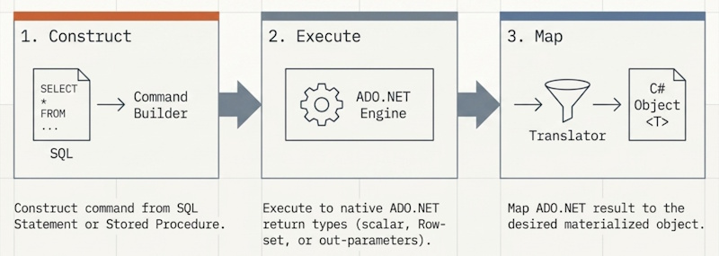

---
## ⚡ Quick Start

Get up and running in your .NET project in under 2 minutes:

### 1. Install Package that matches your target database
Choose the package for your database:

| Database                          | NuGet Package | Install Command |
|:----------------------------------| :--- | :--- |
| [**SQL Server**](./sql-server.md) | `CA.Blocks.SQLServerDataAccess` | `dotnet add package CA.Blocks.SQLServerDataAccess` | 
| [**Sqlite**](./sqlite.md)         | `CA.Blocks.SqliteDataAccess` | `dotnet add package CA.Blocks.SqliteDataAccess` |   
| [**Postgres**](./postgresql.md)   | `CA.Blocks.PostgreSQLDataAccess` | `dotnet add package CA.Blocks.PostgreSQLDataAccess` |    
| [**MySQL**](./mysql.md)          | `CA.Blocks.MySQLDataAccess` | `dotnet add package CA.Blocks.MySQLDataAccess` |    
| **ODBC**                          | `CA.Blocks.OdbcDataAccess` | `dotnet add package CA.Blocks.OdbcDataAccess` |    

### 2. Choose how to resolve your connection strings:

| Method                                                                                                              | Resolver Class                                | Extension Package |
|:--------------------------------------------------------------------------------------------------------------------|:----------------------------------------------| :--- |
| [**appsettings.json**](./../quick-examples/connection-configuration/json-resolver.md)                               | `JsonConfigGetConnectionStringResolver`       | `CA.Blocks.DataAccess.Extensions.Config.Json` |
| [**Environment Variables**](./..//quick-examples/connection-configuration/environment-variables-resolver.md)        | `EnvironmentVariableConnectionStringResolver` | (Built-in) |
| [**In Code**](./../quick-examples/connection-configuration/simple-hardcoded-resolver.md)                            | `HardCodedConnectionStringsResolver`          | (Built-in) |
| [**app.config**](./../quick-examples/connection-configuration/app-config-resolver.md)                               | Custom using ConfigurationManager             | (Built-in) |
| [**custom**](./../quick-examples/connection-configuration/custom-resolver.md)                                       | `IDataAccessKeyToConnectionStringResolver`    | (Built-in) |

### 3. Glue up your data access with the provider and configuration

#### SQL Server Example using Json config
1) Setup you configuration value in the appsettings.json file:
``` json
{
  "ConnectionStrings": {
      "MyDbConnection": "Server=(localdb)\\MSSQLLocalDB;Integrated Security = true"
  }
}
 ```
2) You create you data access class as inherit form the provided `SqlServerDataAccess` class. You glue up the configuration value pointing to the "MyDbConnection" Key
```csharp
public class MyDataAccess : SqlServerDataAccess
{
    public MyDataAccess(IConfiguration configuration) : base (
            new DataAccessConfig(
                new DataAccessConfigOptions { ConnectionStringKey = "MyDbConnection" }, 
                new JsonConfigConnectionStringsResolver(configuration))
        )
        {
        }
     ...
    // your code goes here
    ...
}
```
3) You can now write you data access methods
   The methods follow the same pipeline
   
1) you construct the command from a SQL statement or stored procedure
2) you Execute or execute async the command
3) you then map the results into desired materialised objects

```csharp  
 // Example method to get a IList<MyModel>
 public async Task<IList<MyModel>> GetAllAsync()
 {
     var cmd = CreateCommand("SELECT * FROM MyTable");
     // Step 1 construct the command ^^^^
     return await ExecuteAsync(cmd).ToListOf<MyTableModel>();
     //           Step 2 ^^^execute async
     //                             Step 3 ^^^^ map the row set to a list of MyTableModel
 }
```

## Next Steps

Now that you have the basics down, explore the modular power of the library:

- 🏗️ [Architecture & Design](./../architecture/architecture.md) — Learn about the "Pluggable Building Blocks".
- 📦 [Package Reference](./../architecture/packages.md) — See all available database providers and extensions.
