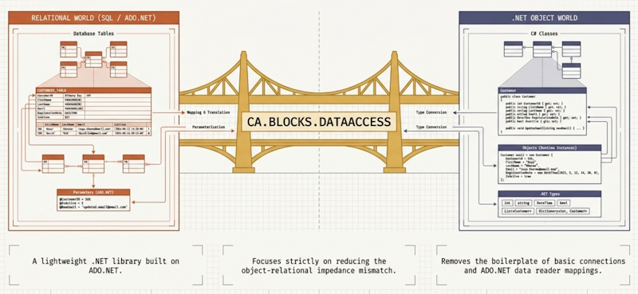

---
layout: default
title: Home
nav_order: 1
description: "Overview and Quick Start for CA.Blocks.DataAccess."
---
# CA.Blocks.DataAccess
Built to help developers write clean data access code faster, CA.Blocks.DataAccess removes the friction of setting up custom repositories and database context boilerplate. It integrates seamlessly with .NET Dependency Injection, giving you an expressive, testable foundation for your database queries out of the box.

📖 Documentation & Guides

Learn more about setting up and extending the library:

🚀 [Quick Start Guide](./getting-started/quick-start.md) — Step-by-step setup and basic usage.

🏗️ [Architecture & Design](./architecture/architecture.md) — How the "Pluggable Building Blocks" work together.

📦 [Package Reference](./architecture/packages.md) — A complete list of all NuGet packages and extensions.

⚙️ [Configuration & DI Options](getting-started/dependency-injection.md) — Connection strings, lifetime options, and extensions.

🧪 [Unit Testing Guide](./unit-testing/index.md) — How to mock repositories and write fast unit tests.

💡 Key Features
Zero Boilerplate: Clean, generic repository implementation out of the box.

Async-First: Native async/await support across all database operations.

DI-Ready: Simple extension methods for native .NET Dependency Injection.

Testable: Built against clean interfaces for effortless mocking.

🤝 Contributing & Source Code
Source Code & Issues: [GitHub Repository](https://github.com/CodeAssociate/CA.Blocks.DataAccess)

Report a Bug: Submit an [Issue](https://github.com/CodeAssociate/CA.Blocks.DataAccess/issues)
