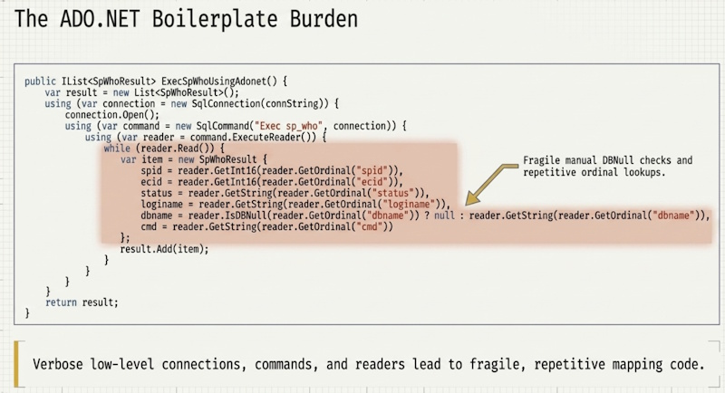
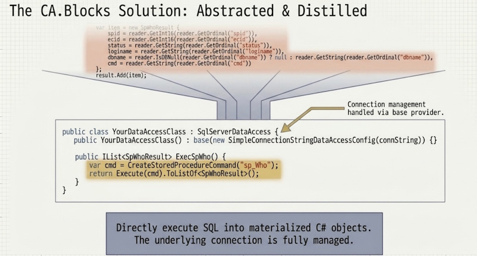

---
layout: default
title: Home
nav_order: 1
description: "Overview and Quick Start for CA.Blocks.DataAccess."
---
# CA.Blocks.DataAccess
Built to help developers write clean data access code faster, CA.Blocks.DataAccess removes the friction of setting up custom repositories and database context boilerplate. It integrates seamlessly with .NET Dependency Injection, giving you an expressive, testable foundation for your database queries out of the box.






---
## ⚡ Quick Start

Get up and running in your .NET project in under 2 minutes:

### 1. Install Package that matches your target database
Choose the package for your database:

| Database       | NuGet Package | Install Command |
|:---------------| :--- | :--- |
| **SQL Server** | `CA.Blocks.SQLServerDataAccess` | `dotnet add package CA.Blocks.SQLServerDataAccess` |
| **Sqlite**     | `CA.Blocks.SqliteDataAccess` | `dotnet add package CA.Blocks.SqliteDataAccess` |
| **Postgres**   | `CA.Blocks.PostgreSQLDataAccess` | `dotnet add package CA.Blocks.PostgreSQLDataAccess` |
| **MySQL**      | `CA.Blocks.MySQLDataAccess` | `dotnet add package CA.Blocks.MySQLDataAccess` |
| **ODBC**       | `CA.Blocks.OdbcDataAccess` | `dotnet add package CA.Blocks.OdbcDataAccess` |

### 2. Choose how to resolve your connection strings:

| Method                                                                                                   | Resolver Class                                | Extension Package |
|:---------------------------------------------------------------------------------------------------------|:----------------------------------------------| :--- |
| [**appsettings.json**](./quick-examples/connection-configuration/json-resolver.md)                       | `JsonConfigGetConnectionStringResolver`       | `CA.Blocks.DataAccess.Extensions.Config.Json` |
| [**Environment Variables**](./quick-examples/connection-configuration/environment-variables-resolver.md) | `EnvironmentVariableConnectionStringResolver` | (Built-in) |
| [**In Code**](./quick-examples/connection-configuration/simple-hardcoded-resolver.md)                    | `HardCodedConnectionStringsResolver`          | (Built-in) |
| [**app.config**](./quick-examples/connection-configuration/app-config-resolver.md)                       | Custom using ConfigurationManager             | (Built-in) |
| [**custom**](./quick-examples/connection-configuration/custom-resolver.md)                               | `IDataAccessKeyToConnectionStringResolver`    | (Built-in) |

### 3. Glue up your data access with the provider and configuration 
#### SQL Server Example using Json config 
1) Setup you configuration value in the appsettings.json file:
``` json
    {
        "ConnectionStrings": {
            "MyDbConnection": "Server=(localdb)\\MSSQLLocalDB;Integrated Security = true"
        }
    }
 ```
2) You create you data access class as inherit form the provided `SqlServerDataAccess` class. You glue up the configuration value pointing to the "MyDbConnection" Key
```csharp
public class MyDataAccess : SqlServerDataAccess
{
    public MyDataAccess(IConfiguration configuration) : base (
            new DataAccessConfig(
                new DataAccessConfigOptions { ConnectionStringKey = "MyDbConnection" }, 
                new JsonConfigConnectionStringsResolver(configuration))
        )
        {
        }
     ...
    // your code goes here
    ...
}
```
3) You can now write you data access methods
The methods follow the same pipeline

1) you construct the command from a SQL statement or stored procedure 
2) you Execute or execute async the command
3) you then map the results into desired materialised objects 

```csharp
public class MyDataAccess : SqlServerDataAccess
{
    public MyDataAccess(IConfiguration configuration) : base (
            new DataAccessConfig(
                new DataAccessConfigOptions { ConnectionStringKey = "MyDbConnection" }, 
                new JsonConfigConnectionStringsResolver(configuration))
        )
        {
        }
     
    public async Task<IList<MyModel>> GetAllAsync()
    {
        var cmd = CreateCommand("SELECT * FROM MyTable");
        // Step 1 construct the command ^^^^
        return await ExecuteAsync(cmd).ToListOf<MyTableModel>();
        //           Step 2 ^^^execute async
        //                             Step 3 ^^^^ map the row set to a list of MyTableModel
    }
}
```

📖 Documentation & Guides

Learn more about setting up and extending the library:

🚀 [Quick Start Guide](quick-start.md) — Step-by-step setup and basic usage.

🏗️ [Architecture & Design](architecture.md) — How the "Pluggable Building Blocks" work together.

📦 [Package Reference](packages.md) — A complete list of all NuGet packages and extensions.

⚙️ [Configuration & DI Options](getting-started/dependency-injection.md) — Connection strings, lifetime options, and extensions.

🧪 Unit Testing Guide — How to mock repositories and write fast unit tests. (Coming Soon)

💡 Key Features
Zero Boilerplate: Clean, generic repository implementation out of the box.

Async-First: Native async/await support across all database operations.

DI-Ready: Simple extension methods for native .NET Dependency Injection.

Testable: Built against clean interfaces for effortless mocking.

🤝 Contributing & Source Code
Source Code & Issues: [GitHub Repository](https://github.com/CodeAssociate/CA.Blocks.DataAccess)

Report a Bug: Submit an [Issue](https://github.com/CodeAssociate/CA.Blocks.DataAccess/issues)
