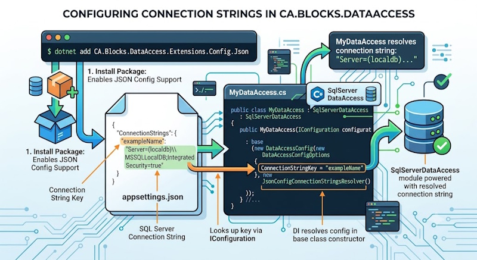

### Json Config Connection Strings Resolver



This is an example implementation of IDataAccessKeyToConnectionStringResolver that uses the Microsoft.Extensions.ConfigurationConfigurationManager class.  
This is common with the .NET Core frameworks and designed using the dependency injection pattern. 

You can write this as [JsonConfigConnectionStringsResolver](https://github.com/CodeAssociate/CA.Blocks.DataAccess/blob/master/CA.Blocks.DataAccess.Extensions.Config.Json/JsonConfigConnectionStringsResolver.cs) in your our code base or simply pull in the extention from Nuget

``` bash 
dotnet add package CA.Blocks.DataAccess.Extensions.Config.Json
```

Example using Json and with config in appsettings.json and a ConnectionString named exampleName

``` JavaScript 
{
    "ConnectionStrings": {
        "exampleName": "Server=(localdb)\\MSSQLLocalDB;Integrated Security = true"
  }
}

```


To use this in from the blocks we need to join the config up notice we are using the JsonConfigConnectionStringsResolver from above

``` csharp
public class MyDataAccess : SqlServerDataAccess
{
    public MyDataAccess(IConfiguration configuration) : base (
            new DataAccessConfig( 
                new DataAccessConfigOptions { ConnectionStringKey = "exampleName" }, 
                new JsonConfigConnectionStringsResolver(configuration))
        )
        {
        }
    ...
}

```

With this setup the class MyDataAccess is ready to have data access methods written. 
In the code example above we are using the  JsonConfigConnectionStringsResolver to resolve the Named connection value  of "exampleName" to the connection string of  "Server=(localdb)\\MSSQLLocalDB;Integrated Security = true". 
